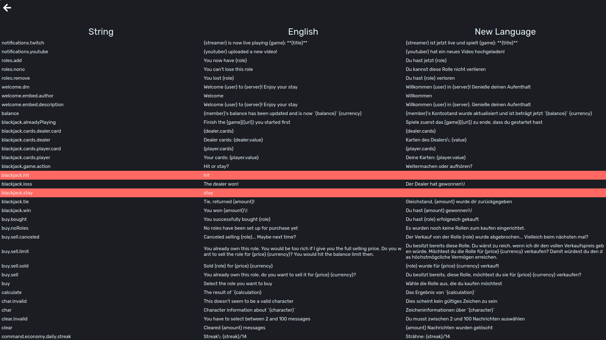
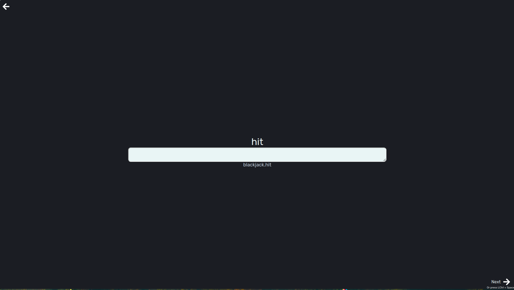
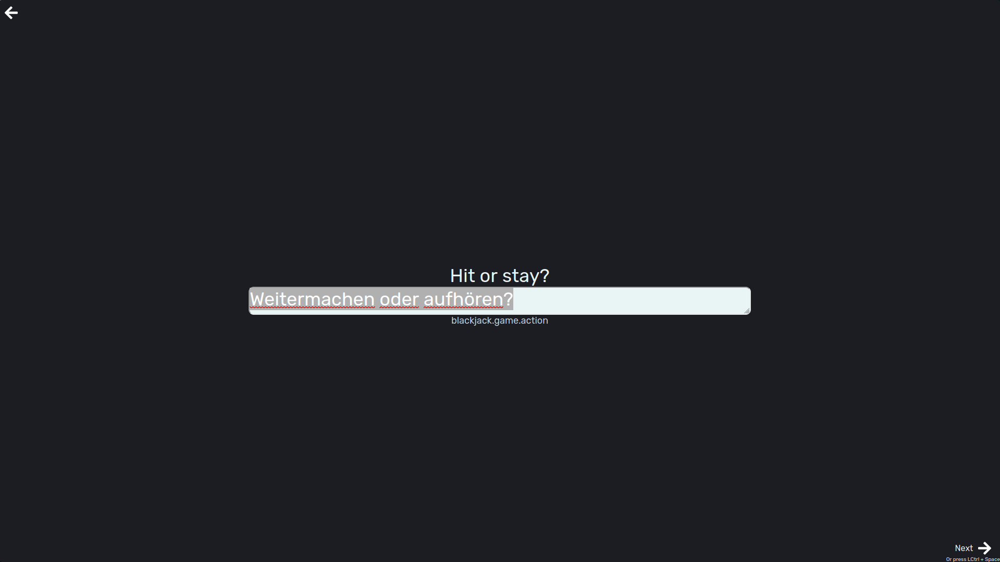

# 🌍 Translate v1

Yes... This is a translation tool written in Java, using plain html/css/js :skull:


## 📌 Table of contents

* [📌 Table of contents](#-table-of-contents)
* [📜 Features overview](#-features-overview)
* [🗃️ Database setup](#-database-setup)
* [📂 Supported file formats](#-supported-file-formats)
  * [`.properties` file](#properties-file)
  * [Regular `.json` file](#regular-json-file)
  * [Commands `.json` file](#commands-json-file)
* [🏳️ Language code](#-language-code)
* [📷 Screenshots](#-screenshots)

## 📜 Features overview

* Support for multiple file formats
* Manage multiple accounts
* Track progress of accounts

## 🗃️ Database setup

Users who are eligible to translate, are stored in a database. For this you would need to set up a MongoDb collection. Each
document represents a user in the following scheme:

| Field name   | Data type | Description                                                        |
|--------------|-----------|--------------------------------------------------------------------|
| username     | string    | Username used to log in to the site                                |
| password     | string    | Password used to log in to the site                                |
| languages    | string[]  | [Language codes](#-language-code) the user is allowed to translate |
| translations | integer   | How many entries did the user translate?                           |

The dashboard has no way of setting those users up. You would need to create the documents manually.

Connect your own database, by putting your credentials in `./src/main/resources/config.properties`

```properties
mongoConnectionString=mongodb://localhost
databaseName=Translate
collectionName=Users
```

## 📂 Supported file formats

The supported file formats are hard coded in, to suit my needs:

### `.properties` file

The `.properties` files, located under `./bot/` are translations files used in the main bot application written in java.
There one file represents one language.

### Regular `.json` file

The `.json` file, located under `./website.json`, is responsible for translations for the website. There all languages are
crammed together in one file, grouped as json objects:

```json
{
  "en-GB": {},
  "de": {},
  "fr": {}
}
```

### Commands `.json` file

Discord commands can get translated as well but because the format is a bit special it needs its own system. Check
the [Discord documentation](https://discord.com/developers/docs/interactions/application-commands) for more information on
them.

## 🏳️ Language code

I used the same language codes Discord is using. In their documentation there is no information on what they have based on
their system, but I assume they used the [BCP 47](https://en.wikipedia.org/wiki/IETF_language_tag) system.

## 📷 Screenshots





